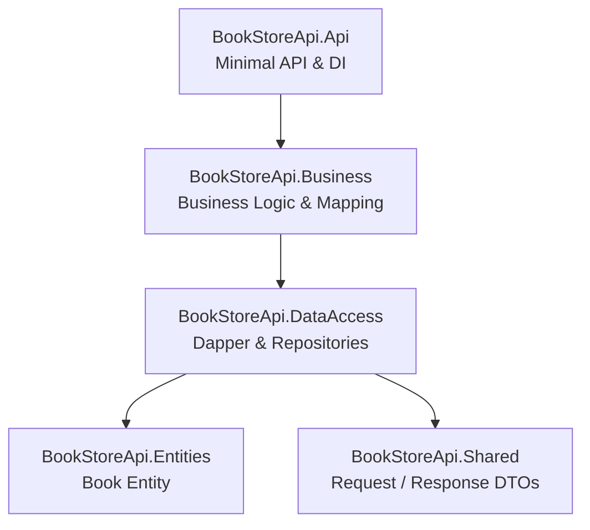

# BookStore API


A RESTful bookstore API built with **ASP.NET Core 10 Minimal API**, **Dapper**, and **PostgreSQL**, following **N-Layer Architecture** principles.

The project demonstrates clean separation of concerns, asynchronous programming, dependency injection, automated unit testing, and a lightweight data access layer without Entity Framework.

## Architecture

This project follows N-Layer Architecture with strict layer separation. Each layer has a single responsibility and only depends on the layer directly below it.



### Key Design Decisions

- `DataAccess` returns `Book` entities and has no knowledge of DTOs.
- `Business` performs all Entity → DTO mapping.
- `Api` depends only on the Business layer.
- `Shared` contains dependency-free DTO records.
- Dapper maps SQL results directly to entities, keeping the data access layer lightweight.

---

## Tech Stack

| Layer | Technology |
|---|---|
| Framework | ASP.NET Core 10 Minimal API |
| Language | C# 14 |
| Data Access | Dapper + Npgsql |
| Database | PostgreSQL (Supabase) |
| Testing | xUnit v3 + Moq |
| Seed Data | Bogus + SemaphoreSlim |
| API Documentation | Scalar + Microsoft.AspNetCore.OpenApi |

---

## Project Structure

```text
src/
├── BookStoreApi.Api/
├── BookStoreApi.Business/
├── BookStoreApi.DataAccess/
├── BookStoreApi.Entities/
└── BookStoreApi.Shared/

tests/
└── BookStoreApi.Business.Tests/
```

---

## Features

- RESTful CRUD API for books
- ASP.NET Core 10 Minimal APIs
- N-Layer Architecture
- Repository Pattern
- Dependency Injection
- Dapper data access
- PostgreSQL database
- OpenAPI + Scalar documentation
- CLI database seeding
- Bogus fake data generation
- CancellationToken support
- Nullable reference types
- Unit testing with xUnit v3
- Mocking with Moq

---

## Testing

The project currently contains automated unit tests for the Business layer.

### Frameworks

- xUnit v3
- Moq

### Current Test Coverage

#### Extension Methods

- CreateBookRequestExtensions
- UpdateBookRequestExtensions
- BookExtensions

#### Business Services

- BookService.GetByIdAsync
- BookService.GetAllAsync
- BookService.CreateAsync
- BookService.UpdateAsync
- BookService.DeleteAsync

---

## Getting Started

### Prerequisites

- .NET 10 SDK
- PostgreSQL database (e.g. Supabase)

### Configuration

Update:

```
src/BookStoreApi.Api/appsettings.json
```

```json
{
  "ConnectionStrings": {
    "DefaultConnection": "Host=...;Database=...;Username=...;Password=..."
  }
}
```

---

### Run the API

```bash
dotnet run --project src/BookStoreApi.Api
```

Development mode exposes Scalar UI at:

```
/scalar
```

---

### Seed the Database

```bash
dotnet run --project src/BookStoreApi.Api -- --seed
```

Generates 1,000 realistic book records using Bogus.

---

## API Endpoints

| Method | Route | Description |
|---|---|---|
| GET | `/api/books` | Retrieve all books |
| GET | `/api/books/{id}` | Retrieve a book by ID |
| POST | `/api/books` | Create a new book |
| PUT | `/api/books/{id}` | Update a book |
| DELETE | `/api/books/{id}` | Delete a book |

---

## Roadmap

- ✅ CRUD API
- ✅ Dapper
- ✅ PostgreSQL
- ✅ xUnit v3 Unit Tests
- ✅ Moq
- 🔄 Repository Integration Tests
- 🔄 Minimal API Integration Tests
- 🔄 Authentication & Authorization
- 🔄 CI/CD Pipeline

---

## License

This project is licensed under the MIT License.